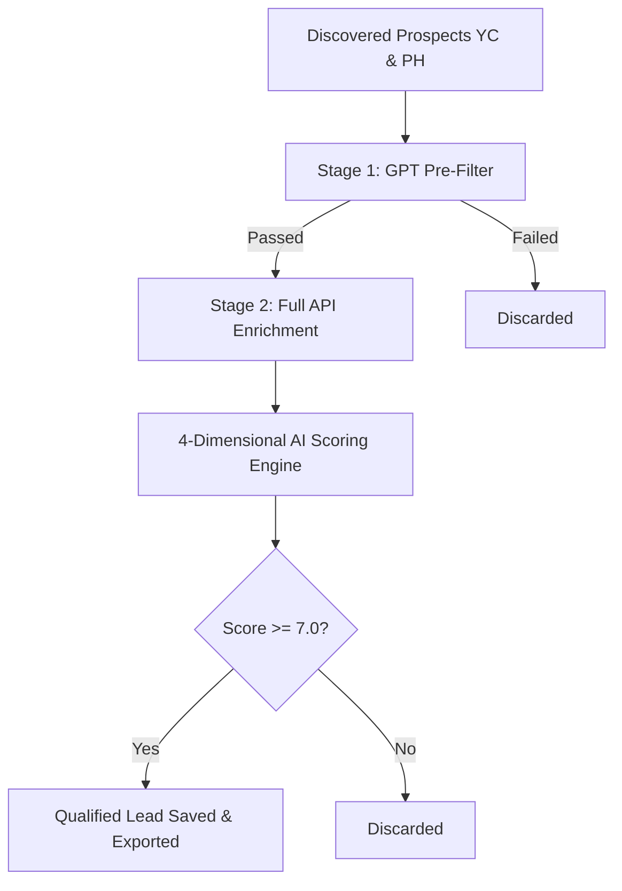

# Lead Qualification & Scoring Criteria

This document details the professional lead qualification framework, target constraints, and scoring rules used by the Timidly Inc Lead Intelligence Platform to identify and verify high-quality sales leads.

---

## 1. Professional Two-Stage Qualification Pipeline

To ensure the highest lead quality, the platform filters prospective companies in two sequential stages:

### Stage 1: AI-Driven Pre-Qualification Filter
Before running expensive, slow enrichment APIs (Firecrawl landing page scrapes or contact lookups), the system applies a lightweight GPT-4o-mini pre-filter based on the company's name and search tagline.
*   **Purpose**: To immediately discard consultancies, localized services, retail e-commerce, design agencies, or low-tech B2C applications.
*   **ICP Focus**: Only companies matching developer tooling, databases, cloud infrastructure, LLM/AI middleware, and technical B2B SaaS are advanced to the enrichment queue.

### Stage 2: Multi-Dimensional Enrichment & Verification
Only pre-qualified companies are enriched. The platform fetches executive LinkedIn contacts (CEOs, Founders, Head of Marketing/Partnerships), crawls website content, gathers recent tweets, and scrapes Google for funding and employee counts.

---

## 2. The 4-Dimensional Fit Scoring Model

Instead of a single subjective score, the platform calculates a weighted average across **4 professional SalesOps dimensions** (each rated from 1 to 10):

### 1. Audience Alignment ($40\%$ Weight)
Evaluates if the company's product/service target audience aligns with developer builders, technical leads, or startup operators.
*   **10 (Perfect)**: Sells directly to software engineers, DBAs, data scientists, or DevOps (e.g. databases, hosting platforms, dev tools).
*   **7 – 8 (Great)**: Sells to startup founders, marketers, product managers, or general operations.
*   **1 – 4 (Poor)**: Sells directly to general consumer retail users (B2C) or non-technical business verticals.

### 3. Budget Maturity ($30\%$ Weight)
Evaluates if the startup has the capital to afford Timidly's premium sponsorship packages ($199 to $1,500).
*   **9 – 10**: Mid-to-late stage startups (Series A-D, or large teams of 100+ employees) with active marketing budgets.
*   **7 – 8**: Early-stage VC-funded startups (Seed stage or active Y Combinator batch).
*   **4 – 6**: Bootstrapped, self-sustained technical SaaS startups with a working product.
*   **1 – 3**: Pre-revenue micro-startups, side projects, or open-source repositories with no commercial monetization.

### 3. Product & Vertical Relevance ($20\%$ Weight)
Evaluates if the company operates within Timidly's core technology focus.
*   **10**: AI infrastructure, LLM operations (LLMOps), databases, development environments, and technical APIs.
*   **7 – 8**: Technical B2B software, GTM automations, visual editor builders, or cyber-security.
*   **4 – 6**: General B2B business SaaS (e.g. HR tools, financial trackers).
*   **1 – 3**: Non-technical domains, services, agencies, or physical product sales.

### 4. Traction & Growth Signals ($10\%$ Weight)
Evaluates buying signals and active digital presence.
*   **10**: High social activity, recent product launches on Product Hunt, open positions for sales/GTM, or recent funding announcements.
*   **1 – 3**: Dormant Twitter presence, outdated website, or no recent updates.

---

## 3. Strict Acceptance Threshold

$$\text{Final Fit Score} = \text{round}(0.4 \times \text{Audience} + 0.3 \times \text{Budget} + 0.2 \times \text{Relevance} + 0.1 \times \text{Traction})$$

*   **Score $\ge 7.0$ (Qualified)**: The company is saved to history (`learned_leads.json`), added to the active dashboard, and exported to your reports (DOCX/CSV).
*   **Score $< 7.0$ (Discarded)**: The company is skipped, logged as `[DISCARDED]`, and excluded from all exports.

---

## Document Navigation

*   [README.md](README.md) — Product Overview & Launch
*   [DOCUMENTATION_V1.md](DOCUMENTATION_V1.md) — User & Admin Operations Guide
*   [USAGE.md](USAGE.md) — Environment variables & CLI usage reference
*   [ARCHITECTURE.md](ARCHITECTURE.md) — Project layout & Module maps
*   [TECHNICAL_ARCHITECTURE.md](TECHNICAL_ARCHITECTURE.md) — Technical system design details
*   [WORKFLOW.md](WORKFLOW.md) — Pipeline data processing stages
*   [OWASP_TOP_10.md](OWASP_TOP_10.md) — Security remediations & Checklist
*   [Operations-Runbook.md](Operations-Runbook.md) — Operations & Troubleshooting runbook
*   [INTEGRATIONS_LIST.md](INTEGRATIONS_LIST.md) — API configurations & Cost structure
*   [LEAD_QUALIFICATION_CRITERIA.md](LEAD_QUALIFICATION_CRITERIA.md) — Fit scoring framework & Criteria
