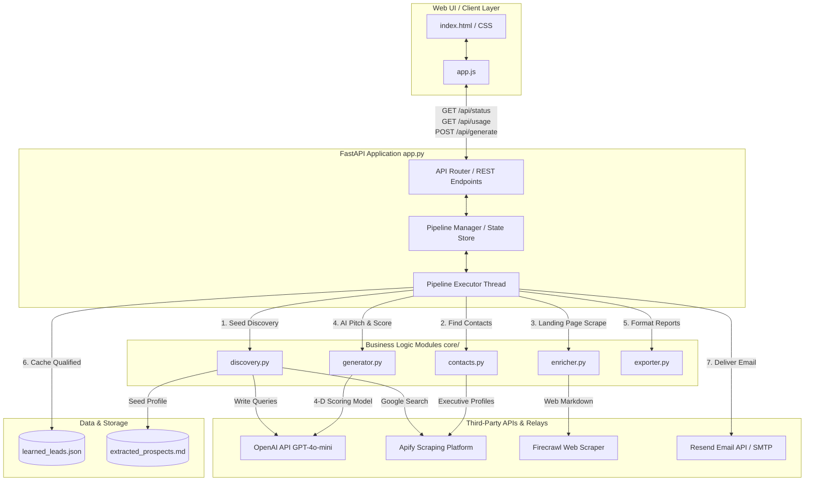

# Technical Architecture Document: Timidly Inc Lead Intelligence Platform

This document describes the technical architecture, design patterns, component relationships, data flow, third-party integrations, and security considerations of the Lead Intelligence Platform.

---

## 1. System Architecture Diagram

The application is structured as a decoupled web application with a FastAPI backend server orchestrating core background pipeline tasks, and a dynamic HTML5/JavaScript user interface dashboard.



---

## 2. Tech Stack Choices

The tech stack is selected for high performance, ease of deployment, and minimal operational overhead:

*   **FastAPI (Python 3.10+)**: Chosen for its fast development speed, asynchronous request handling, automatic OpenAPI/Swagger documentation, and native support for background tasks and thread orchestration.
*   **Vanilla Frontend (HTML5 / Vanilla JS / Vanilla CSS)**: Replaces complex frontend build pipelines (like React/Webpack). Operates with zero build steps, serving pages instantly over Render or Vercel static endpoints. Styling implements premium glassmorphism, HSL tail-colors, dark modes, and transition micro-animations.
*   **File-Based JSON Cache (`learned_leads.json`)**: Eliminates the database management layer (e.g. Postgres or Redis). Serves as a lightweight memory store, enabling fast duplication filtering, self-learning few-shot training, and caching.
*   **Pydantic (Pydantic v2)**: Used to enforce structured data types throughout the pipeline, particularly matching JSON responses from OpenAI to specific lead schemas.

---

## 3. Data Flow

The lead generation data path moves sequentially through seven primary steps:

```
[1. ICP Scan] ────> [2. Discovery] ────> [3. Pre-Filter] ────> [4. Contact Lookup]
                                                                        │
[7. Mailer] <──── [6. Export & Cache] <──── [5. 4D Scoring] <──── [Enrichment]
```

1.  **ICP Profiling**: `discovery.py` reads the original prospects file `extracted_prospects.md` to understand target features.
2.  **Prospect Discovery**: Generates queries via OpenAI and scrapes Product Hunt and Y Combinator via Apify.
3.  **Pre-Qualification Filtering**: Before scraping websites or decision-maker profiles, OpenAI GPT-4o-mini performs a lightweight screening of taglines. Consultancies, retail e-commerce, and agencies are immediately discarded to save credit consumption.
4.  **Executive Enrichment**: `contacts.py` queries Google to find decision-makers (Founder, CEO, Head of Marketing, Partnerships) on LinkedIn.
5.  **Landing Page Scraping & Firmographics**: Landing page contents are scraped into markdown format using Firecrawl. Google searches fetch funding stages and headcount estimates.
6.  **Professional Fit Scoring**: `generator.py` rates the prospect from 1 to 10 across 4 dimensions: *Audience Alignment*, *Budget Maturity*, *Product Relevance*, and *Traction/Growth*. If the final score is $< 7.0$, it is discarded.
7.  **Export & Delivery**: `exporter.py` outputs reports to DOCX and CSV formats. If `RESEND_API_KEY` is present, it mails them as attachments via the Resend HTTP API. Otherwise, it falls back to SMTP over port 465/587.

---

## 4. Third-Party Integrations

The platform orchestrates four critical external APIs:

| Integration | Role | Endpoints Used | Authentication |
|---|---|---|---|
| **OpenAI** | Pitch writing, pre-qualification filtering, and decomposed scoring. | `POST /v1/chat/completions` (GPT-4o-mini) | Bearer API Key |
| **Apify** | Search scraping for YC, Product Hunt, executive LinkedIn profiles, and contact details. | `POST /v2/actor-runs`, `GET /v2/datasets` | Query Parameter Token |
| **Firecrawl** | Scraping startup websites and formatting clean markdown. | `POST /v1/scrape` | Bearer API Key |
| **Resend** | Delivering lead reports bypassing SMTP port blocks. | `POST /v1/emails` | Bearer API Key |

---

## 5. Security & Fail-Safe Considerations

### Secrets Management
No secrets are committed to version control. Configuration is loaded in `config.py` from environment variables. For local deployment, these are loaded from a git-ignored `.env` file. For production, they are configured securely in Render's environment settings.

### Robust Fail-Safe Design
1.  **Per-Lead Error Isolation**: The loop in `app.py` runs inside a try-except wrapper. A timeout or scraper failure on one lead will log a warning and advance to the next, protecting the execution batch.
2.  **Scraper Redundancy**: If Apify search scrapers fail or run out of credits, the platform triggers a fail-safe that uses OpenAI to brainstorm target leads matching the ICP that have not already been targeted.
3.  **Port Blocking Workaround**: Free tier cloud hosts (like Render) block outbound SMTP ports 25, 465, and 587. By integrating the Resend HTTP API (communicating over HTTPS port 443), we bypass these port blocks entirely.
